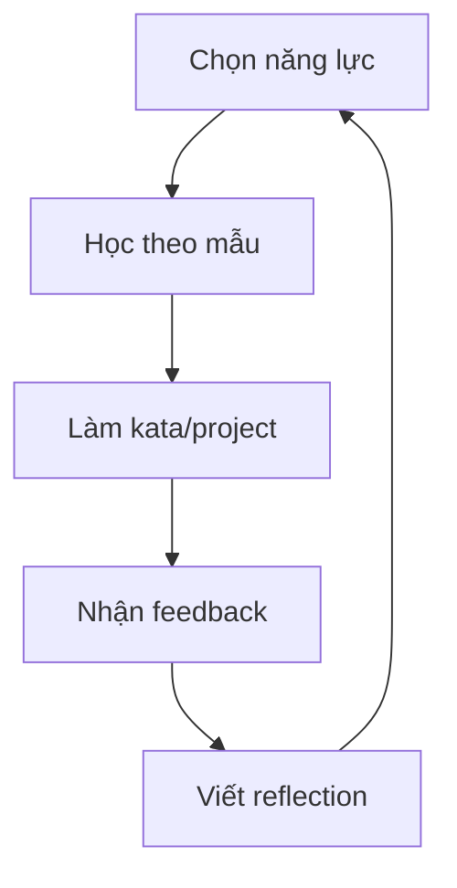

# Hệ Thống Học Tập

Hệ thống này biến Shu-Ha-Ri thành vòng lặp hằng ngày và hằng tuần. Bạn sẽ không chỉ "học một khóa"; bạn sẽ tích lũy bằng chứng năng lực.

## Vòng lặp 5 bước

## 1. Chọn năng lực

Mỗi tuần chỉ chọn một năng lực chính. Một sprint có thể dùng AI, software và CS cùng lúc, nhưng chỉ một năng lực được xem là mục tiêu.

Ví dụ:

- "Đọc query plan và tối ưu SQL".
- "Viết API có test và validation".
- "Tạo RAG eval set và đo faithfulness".
- "Hiểu BFS/DFS qua 10 bài tập và 1 visualizer".

## 2. Học theo mẫu

Ở Shu, dùng nguồn có uy tín và làm đúng trước:

- Đọc docs/course note.
- Chạy ví dụ gốc.
- Copy pattern bằng tay.
- Ghi lại những từ khóa chưa hiểu.
- Tạo checklist thao tác.

Output bắt buộc:

- 1 note "mình đã làm gì".
- 1 artifact chạy được: code, query, notebook, script, diagram.
- 1 danh sách lỗi gặp phải.

## 3. Làm kata hoặc project

Kata là bài lặp lại để tăng độ chính xác. Project là bài tổng hợp để tăng khả năng ra quyết định.

Tỉ lệ gợi ý:

- Đang Shu: 70% kata, 30% project.
- Đang Ha: 40% kata, 60% project.
- Đang Ri: 20% kata, 80% project/teaching/open source.

## 4. Nhận feedback

Feedback tốt phải gắn với hành vi quan sát được:

- Unit test, integration test, benchmark.
- Static analysis, lint, type check.
- Code review từ người khác.
- AI review có prompt rõ ràng.
- So sánh với implementation chuẩn.
- User feedback nếu có sản phẩm.

Checklist feedback:

- Kết quả có đúng không?
- Có edge case nào hỏng?
- Có cách đơn giản hơn không?
- Có trade-off nào đã bỏ qua?
- Có bằng chứng nào cho performance, cost, security, UX?

## 5. Viết reflection

Reflection là nơi bạn chuyển kinh nghiệm thành tri thức.

Mẫu 5 dòng:

- Hôm nay tôi luyện: ...
- Điều tôi làm đúng: ...
- Lỗi/sai lệch quan trọng: ...
- Nguyên lý tôi rút ra: ...
- Biến thể tiếp theo tôi sẽ thử: ...

## Daily rhythm 60-120 phút

| Thời gian | Hoạt động |
| --- | --- |
| 10 phút | Chọn bài tập và đọc lại checklist |
| 25-45 phút | Deep work: code/giải bài/đọc papers |
| 10 phút | Chạy test/benchmark/quiz |
| 15-30 phút | Sửa lỗi và ghi log |
| 5 phút | Chọn bước tiếp theo |

## Weekly rhythm

| Ngày | Trọng tâm |
| --- | --- |
| Thứ 2 | Chọn sprint, định nghĩa output |
| Thứ 3-5 | Kata + implementation |
| Thứ 6 | Feedback, test, benchmark, review |
| Thứ 7 | Viết reflection dài, cập nhật portfolio |
| Chủ nhật | Nghỉ/nhìn lại/chọn hướng tuần sau |

## Portfolio là bộ nhớ dài hạn

Mỗi project nên có:

- README nói vấn đề, cách chạy, kết quả.
- Tests hoặc evals.
- Decision log: tại sao chọn cách này.
- Failure log: những gì đã thử nhưng không hiệu quả.
- Next iteration: nếu có thêm 1 tuần sẽ làm gì.

## Sử dụng AI assistant đúng cách

Dùng AI như mentor, reviewer, rubber duck, không dùng như máy làm bài thay.

Nên dùng AI để:

- Giải thích một concept bằng 2-3 cách.
- Tạo checklist review.
- Sinh test case và edge case.
- So sánh trade-off.
- Review code/notebook.
- Tạo quiz sau khi học.

Không nên dùng AI để:

- Bỏ qua việc đọc docs gốc.
- Copy code mà không chạy/không hiểu.
- Tin vào câu trả lời không có test, citation, hoặc bằng chứng.
- Tự đánh giá năng lực chỉ dựa trên cảm giác "mình đọc thấy hiểu".
