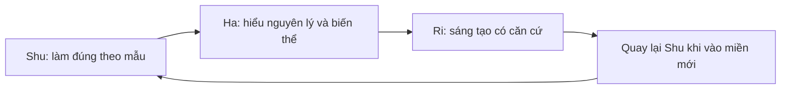

# Shu-Ha-Ri Learning Project

Dự án này áp dụng Shu-Ha-Ri vào việc học và phát triển năng lực về software engineering, AI/ML và computer science. Mục tiêu không phải là tạo thêm một roadmap dài vô tận, mà là tạo một hệ thống giúp bạn biết mình đang ở đâu, nên luyện gì tiếp theo, và khi nào đủ cơ sở để phá cách.

## Cách đọc nhanh

1. Bắt đầu với [01-nguyen-ly-shu-ha-ri.md](01-nguyen-ly-shu-ha-ri.md) để nắm khung tư duy.
2. Dùng [02-ban-do-nang-luc.md](02-ban-do-nang-luc.md) để chọn năng lực hiện tại cần phát triển.
3. Chọn một track trong `04`, `05`, hoặc `06`.
4. Lập sprint tuần bằng [09-templates.md](09-templates.md).
5. Đánh giá bằng [08-rubric-danh-gia.md](08-rubric-danh-gia.md) mỗi cuối tuần.

## Các file trong dự án

| File | Vai trò |
| --- | --- |
| [01-nguyen-ly-shu-ha-ri.md](01-nguyen-ly-shu-ha-ri.md) | Diễn giải Shu, Ha, Ri cho người học kỹ thuật |
| [02-ban-do-nang-luc.md](02-ban-do-nang-luc.md) | Bản đồ năng lực software, AI, CS theo cấp độ |
| [03-he-thong-hoc-tap.md](03-he-thong-hoc-tap.md) | Vòng lặp học tập, ghi chép, feedback, portfolio |
| [04-track-software-engineering.md](04-track-software-engineering.md) | Lộ trình software engineering theo Shu-Ha-Ri |
| [05-track-ai-ml.md](05-track-ai-ml.md) | Lộ trình AI/ML/LLM engineering theo Shu-Ha-Ri |
| [06-track-computer-science.md](06-track-computer-science.md) | Lộ trình nền tảng CS theo Shu-Ha-Ri |
| [07-kata-du-an-thuc-hanh.md](07-kata-du-an-thuc-hanh.md) | Bài kata và project tăng dần độ khó |
| [08-rubric-danh-gia.md](08-rubric-danh-gia.md) | Rubric tự đánh giá và chuyển giai đoạn |
| [09-templates.md](09-templates.md) | Template learning log, sprint, review, project brief |
| [10-nguon-tham-khao.md](10-nguon-tham-khao.md) | Nguồn đọc và tài liệu nền tảng |
| [11-ke-hoach-12-tuan.md](11-ke-hoach-12-tuan.md) | Kế hoạch mẫu 12 tuần để bắt đầu |

## Ý tưởng cốt lõi

Shu-Ha-Ri là một cách nhìn về tiến trình thành thạo:

Trong kỹ thuật, nguy cơ lớn nhất là nhảy qua giai đoạn Shu vì thấy nó chậm, hoặc mắc kẹt ở Shu vì sợ sai. Dự án này ép hai việc cùng xảy ra: luyện cơ bản có kỷ luật và liên tục biến chúng thành sản phẩm nhỏ có thể kiểm tra.

## Đơn vị học tập mặc định

Mỗi chu kỳ học là một sprint 1 tuần:

- 1 năng lực chính.
- 1 bài kata lặp lại.
- 1 sản phẩm nhỏ có thể chạy, đọc, hoặc demo.
- 1 feedback từ test, người khác, AI assistant, hoặc rubric.
- 1 ghi chép về điều đã hiểu và điều còn mờ.

## Quy tắc vận hành

- Học bằng sản phẩm: mỗi chủ đề phải kết thúc bằng code, bài giải, thiết kế, note kỹ thuật, hoặc demo.
- Học bằng lặp lại: dùng kata cho những kỹ năng nền tảng như Git, testing, SQL, debugging, prompt/eval.
- Học bằng giải thích: nếu không giải thích được bằng ngôn ngữ của mình, chưa qua Shu.
- Học bằng biến thể: nếu chưa thử biến thể và biết trade-off, chưa qua Ha.
- Học bằng đóng góp: Ri cần có thứ gì đó có thể giúp người khác học lại từ bạn.

## Kết quả mong muốn

Sau khi dùng dự án này nghiêm túc, bạn sẽ có:

- Một bản đồ năng lực cá nhân cho software, AI và CS.
- Một portfolio project có log học tập và lý do thiết kế.
- Thói quen review tiến độ theo bằng chứng thay vì cảm tính.
- Khả năng biết khi nào nên bắt chước, khi nào nên biến thể, khi nào nên tự tạo cách riêng.
